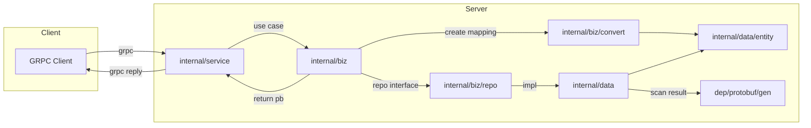
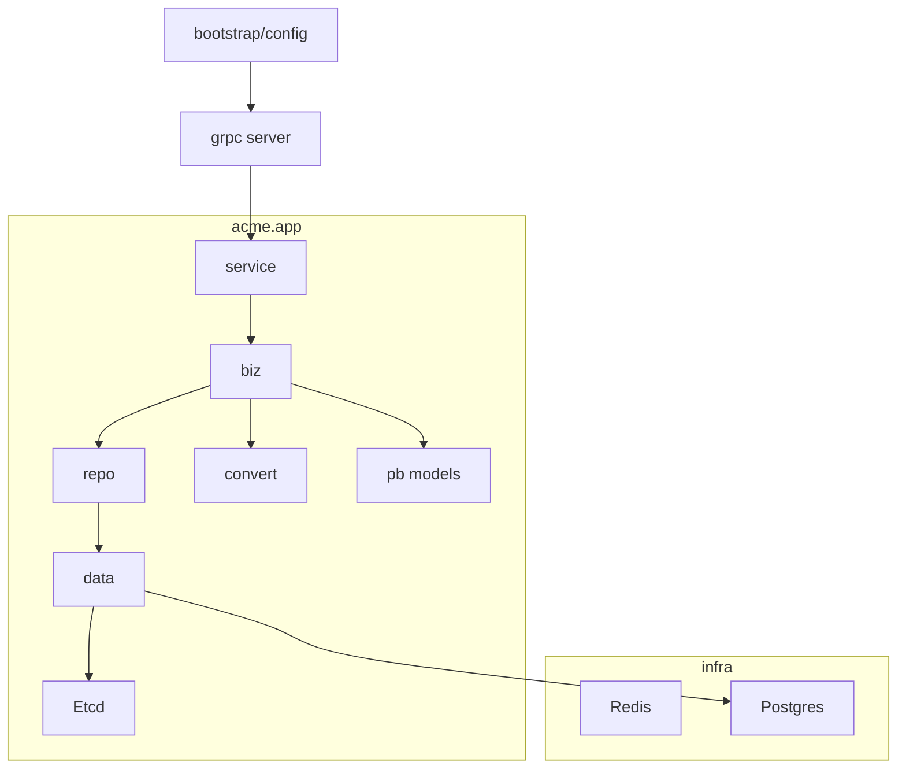

# 项目分析报告（app service）

## 概述
本报告对 `app` 服务进行全面梳理，涵盖项目结构、核心业务与技术栈、模块依赖与数据流、代码质量评估、技术债务清单、关键代码片段，以及后续优化路线图。报告面向维护者与新成员，帮助快速理解并改进整体工程质量。

---

## 项目结构分析

### 顶层目录结构与职责
- `cmd/server/`：服务入口与依赖注入（wire），进程启动配置（`app.go`、`main.go`、`wire.go`）
- `internal/`
    - `biz/`：领域用例（UseCase）、仓库接口、模型转换（Create 映射），核心业务流程控制
    - `data/`：数据访问实现（GORM），实体模型（`entity/`），事务、数据源配置
    - `server/`：服务注册与 gRPC Server 管理
    - `service/`：gRPC 服务实现（Handler），编排 biz 用例
    - `conf/`：配置加载与依赖（Redis、Postgres、Etcd 等）
    - `dto/`：由 goverter 生成的创建映射 DTO（Create-only 映射输出文件）
- `dep/protobuf/gen/`：Proto 生成的 pb 模型与 gRPC Stub（acme.* 命名空间）
- `docs/`：项目说明与指南（架构分层、最佳实践、数据流转等）
- 根文件：`README.md`、`go.mod`、`makefile`、`buf.gen.yaml`、`conf/bootstrap.json`

### 核心业务模块与技术栈
- 业务模块（acme.app.*）：`type`、`category`、`category.policy`、`version`、`dev.language`、`dev.framework`、`page`、`page.control`、`menu`、`api`、`api.group`
- 技术栈组成：
    - 语言与运行：`Go`（gRPC 服务）、`wire` 依赖注入
    - 通信与接口：`gRPC` + `protobuf`（buf.gen 生成 pb 与 grpc stub）
    - 数据访问：`GORM`（`github.com/lhdhtrc/gorm` 扩展）、事务管理
    - 公共库：`github.com/lhdhtrc/func-go`（object 差异过滤、array、tree 等）、`micro-go`（上下文用户态）
    - 配置与基础设施：`Redis`、`Postgres`、`Etcd`（`internal/conf/*`）

### 模块依赖关系与数据流向
- 服务层（`internal/service/*`）接收 gRPC 请求 → 调用用例（`internal/biz/*`）
- 用例层根据请求路由到仓库接口（`internal/biz/repo/*`）→ 数据层实现（`internal/data/*`）执行查询/变更
- 数据层将查询结果直接扫描为 `pb` 模型（列表统一为 `*pb.XxxList`，详情与简表为 `*pb.Xxx`/`*pb.XxxSimple`）返回
- 转换层（`internal/biz/convert/*`）仅保留“创建请求 → 实体”的映射，避免冗余的双向转换
- gRPC 注册（`internal/server/grpc.go`）汇聚各服务并注册至 Server



---

## 代码质量评估

### 代码总量（文件数，按模块）
- `internal/biz`：约 40 个 Go 文件
- `internal/data`：约 31 个 Go 文件
- `internal/server`：4 个 Go 文件
- `internal/service`：13 个 Go 文件
- `internal/conf`：6 个 Go 文件
- `internal/dto`：12 个 Go 文件（goverter 输出）
- `cmd/server`：4 个 Go 文件
- `dep/protobuf/gen`：约 45 个 `pb.go` 文件（生成代码，不计入业务质量统计）

说明：以上为当前仓库快照的文件数统计，生成代码（pb.go）不纳入业务质量评估。

### 规范遵循情况
- 一致的层次分层：`service → biz → repo → data → entity` 清晰稳定
- 请求/响应类型统一：以 proto 生成的 `pb` 类型为仓库与数据层的标准返回，避免内部“二次模型”
- 转换职责单一：`convert` 仅保留创建请求映射，减少重复代码与维护成本
- 更新操作使用差异过滤：统一通过 `object.FilterChangeValue(..., convert.ProtoIgnoreFields)` 过滤内部字段（`state/sizeCache/unknownFields`）

### 重复代码与潜在优化点
- 重复的“列表查询 + 分页 + 排序 + 搜索键”模式可抽象为通用查询构建器
- 多模块的 “Simple 列表/映射” 流程重复，可通过统一的 helper 函数返回 Map/List
- GORM 直接扫描至 `pb` 结构在复杂联表场景需谨慎（已在 `category.policy` 中通过本地结构映射后构造 `pb.PolicyRow`），建议形成模式化封装
- 缺少集中式错误码/错误包装策略（目前直接返回 `res.Error`）
- 日志字段与审计（操作人、来源等）可统一在数据层钩子/中间件中落库

#### 代码质量指标（样例表）
| 指标 | 当前状态 | 建议目标 |
|------|----------|----------|
| 分层一致性 | 高 | 保持 |
| pb 类型统一使用 | 高 | 保持 |
| 转换职责单一 | 高 | 保持 |
| 重复查询模式 | 中 | 引入查询构建器 |
| 单元测试覆盖率 | 低（待补充） | ≥70% |
| 错误码与日志规范 | 中 | 统一规范 |

---

## 关键代码片段示例

- 创建 API 时附加租户与应用上下文（`internal/biz/app_api.go:26`）
```go
row := uc.dto.ToCreate(request)
row.AppId = um.AppId
row.TenantId = um.TenantId
return uc.repo.CreateApi(ctx, row)
```

- 列表查询直接返回 pb List（`internal/data/app_menu.go:55`）
```go
var raw pb.MenuList
sql := repo.data.db.WithContext(ctx).Model(&entity.AppMenu{})
sql.Where("app_id = ?", um.AppId)
sql.Where("tenant_id = ?", um.TenantId)
sql.Count(&raw.Total)
sql.Scopes(scope.WithPagination(request.Page, request.PageSize))
sql.Order("sort ASC, created_at ASC")
sql.Find(&raw.List)
return &raw
```

- 更新操作差异过滤并忽略 proto 内部字段（`internal/biz/app_type.go:48`）
```go
updates := object.FilterChangeValue(row, request, convert.ProtoIgnoreFields)
if len(updates) == 0 { return nil }
return uc.repo.UpdateType(ctx, request.Id, updates)
```

- 联表结果构造 `PolicyRow`（`internal/data/app_category_policy.go:26`）
```go
raw.List[i] = &pb.PolicyRow{
    Type:      &pb.Meta{Id: r.TypeId, Name: r.TypeName, Icon: r.TypeIcon},
    Category:  &pb.Meta{Id: r.CategoryId, Name: r.CategoryName, Icon: r.CategoryIcon},
    Language:  &pb.Meta{Id: r.LanguageId, Name: r.LanguageName, Icon: r.LanguageIcon},
    Framework: &pb.Meta{Id: r.FrameworkId, Name: r.FrameworkName, Icon: r.FrameworkIcon},
    Id:        r.ID,
    CreatedAt: r.CreatedAt.Format(time.RFC3339),
    UpdatedAt: r.UpdatedAt.Format(time.RFC3339),
}
```

---

## 技术栈说明
- 语言运行：Go 1.x
- RPC：gRPC（proto 生成，`buf.gen.yaml` 配置）
- 数据库：Postgres（`internal/conf/postgres.go`），GORM（分页、排序、联表）
- 缓存与注册：Redis、Etcd（`internal/conf/*.go`）
- 依赖注入：Wire（`cmd/server/wire.go`）
- 公共库：func-go（object/array/tree），micro-go（用户上下文）
- 代码生成：protobuf（pb/go），goverter（创建映射 DTO 输出至 `internal/dto/*`）

---

## 技术债务清单
- 单元测试与集成测试缺失（UseCase、Repo、Data 层）
- 查询模式未抽象：分页、搜索键、排序逻辑重复
- 错误码与日志落库未统一：缺少统一拦截与结构化记录
- GORM 扫描至 pb 在复杂场景易脆弱：建议统一 Mapper 层进行构造
- 领域事件与审计缺失：无统一的操作审计与事件发布机制
- 文档与示例需补充：面向外部的 API 示例与错误约定说明

---

## 后续优化建议路线图
1. 测试建设：
    - 单元测试覆盖 UseCase/Repo/Data（≥70% 覆盖率）
    - 引入 Testcontainers 做集成测试（Postgres/Redis/Etcd）
2. 查询构建器：
    - 抽象分页/排序/搜索键为统一函数或方法（减少重复）
3. 错误与日志：
    - 统一错误码枚举与错误包装，结构化日志（访问/操作/服务）
4. 数据映射稳健化：
    - 复杂联表统一通过临时结构 + Mapper 构造 pb（避免直接扫描）
5. 文档与示例：
    - 完整 API 示例、错误约定、上下文使用说明
6. 性能与可观测：
    - 增加 tracing/metrics，中间件化数据库慢查询检测

---

## 项目架构图（Mermaid）


---

## 当前项目状态总结
- 分层清晰、pb 类型统一、转换职责单一，整体工程结构健康
- 仍存在重复查询模式、缺少测试与统一错误规范等问题，建议分阶段优化

## 运行方式
- `make run`
- `make build`

---

## 附录：功能与依赖
- Features：
    - acme.app.type.v1 / category.v1 / category.policy.v1 / version.v1
    - dev.language.v1 / dev.framework.v1 / page.v1 / page.control.v1
    - menu.v1 / api.v1 / api.group.v1
- Depend：
    - acme.config.v1 / acme.logger.access.v1 / acme.logger.server.v1 / acme.logger.operation.v1
